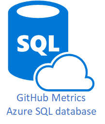

# Initialize Azure SQL



For now a manual process. This may be automated in the future.

1. Open the Azure Portal
1. Navigate to the Azure SQL Database, by default named `github-metrics`
1. Open the Query Editor
1. Authenticate with the Azure SQL Database using the SQL Admin user and password you used when you deployed the solution.
1. Create the GitHubStats table

    ```sql
    SET ANSI_NULLS ON
    GO

    SET QUOTED_IDENTIFIER ON
    GO

    CREATE TABLE [dbo].[GitHubStats](
        [repo_id] [bigint] NOT NULL,
        [date] [datetime] NOT NULL,
        [id] [int] IDENTITY(1,1) NOT NULL,
        [repo] [nvarchar](256) NOT NULL,
        [group] [nvarchar](64) NOT NULL,
        [clones] [int] NULL,
        [views] [int] NULL,
        [stars] [int] NULL,
        [forks] [int] NULL,
        [active] [bit] NOT NULL,
     CONSTRAINT [PK_GitHubStats] PRIMARY KEY CLUSTERED
    (
        [repo_id] ASC,
        [date] ASC
    )WITH (STATISTICS_NORECOMPUTE = OFF, IGNORE_DUP_KEY = OFF, OPTIMIZE_FOR_SEQUENTIAL_KEY = OFF) ON [PRIMARY]
    ) ON [PRIMARY]
    GO

    ALTER TABLE [dbo].[GitHubStats] ADD  CONSTRAINT [DF_GitHubStats_active]  DEFAULT ('true') FOR [active]
    GO
    ```

1. Create the GitHubStatsDaily view

    ```sql
    SET ANSI_NULLS ON
    GO

    SET QUOTED_IDENTIFIER ON
    GO

    CREATE VIEW [dbo].[GitHubStatsDaily]
    AS

    SELECT TOP(100) PERCENT [group] AS team, repo, clones, [stars], forks, [views], date, EOMONTH(date) AS month_ending, DATEFROMPARTS(YEAR(date),MONTH(date),1)AS [month]
    FROM  dbo.GitHubStats
    WHERE active = 'true'
    GO
    ```