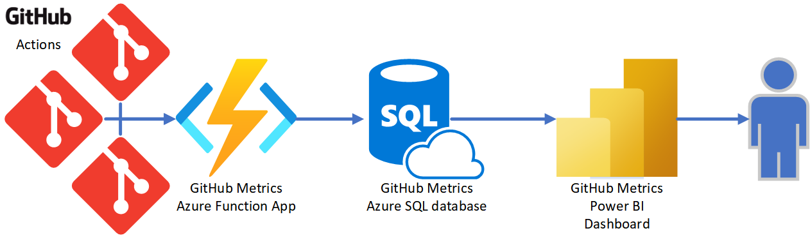
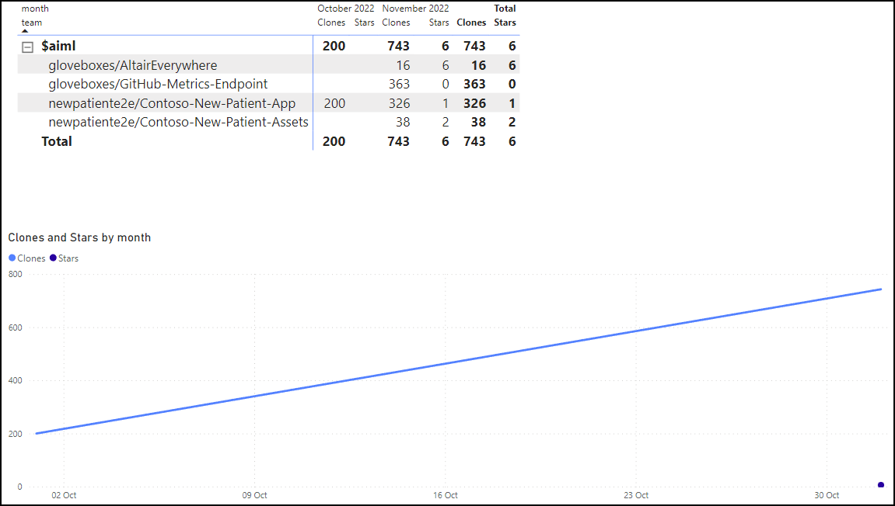

# Introduction

## TLDR

Ever wanted to track your GitHub clones, stars stats over time for as long as you want? Well, now you can!

To track your GitHub stats, you need:

1. Access to a deployed GitHub metrics tracker, or [deploy your own](10-deploy-solution/03-introduction.md).
1. To set up a [GitHub action](20-metrics-tracker/05-introduction.md) to post metrics to the tracker.

Here's a high level overview of the solution architecture:

<!-- ## Getting started

GitHub does not provide a way to track metrics for more than 14 days. This solution tracks metrics for any GitHub repo for as long as you want.

GitHub metrics are collected by a GitHub action triggered by a scheduled event. The GitHub action collects metrics from the GitHub API and posts the metrics to an Azure Function App webhook. The Azure Function App webhook is a secure endpoint that accepts the metrics payload and stores the metrics in an Azure SQL database. Power BI is used to visualize the metrics data. -->

## Reporting with Power BI

The GitHub repo metrics data is stored in an Azure SQL database. Numerous reporting tools can visualize data from Azure SQL. This solution uses Power BI to visualize the data. Azure SQL is used with Power BI as it supports [Power BI Direct Query](https://docs.microsoft.com/en-us/power-bi/connect-data/desktop-directquery), a more efficient way to connect to data sources.

## Contributing

This [GitHub Metrics](https://github.com/gloveboxes/GitHub-Metrics-Endpoint) project is open source and welcomes contributions. Please raise an issue or submit a pull request.
